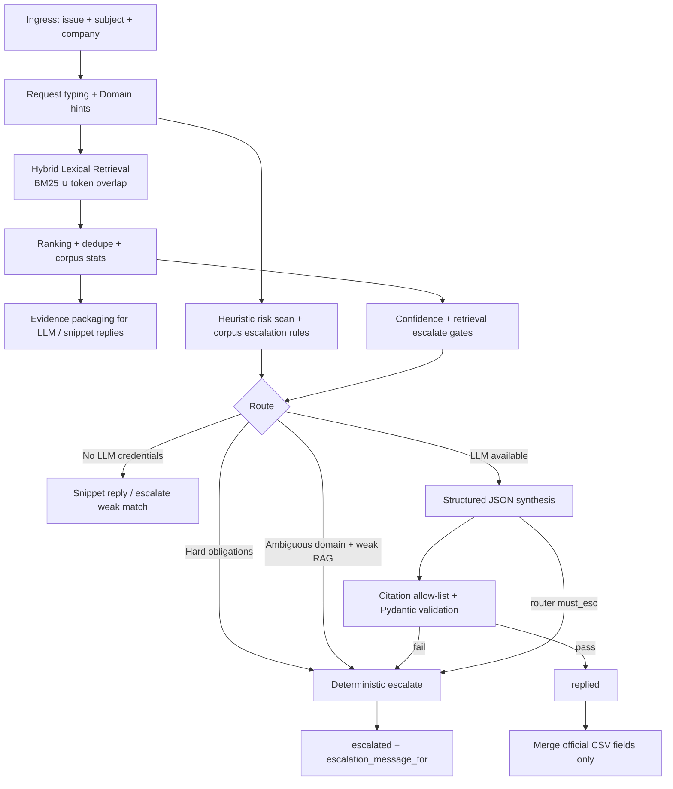
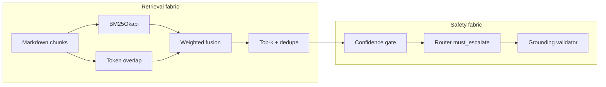

# Support Triage Fabric

**Orchestrate May 2026** — corpus-only, multi-domain support triage with **deterministic lexical RAG**, **risk-aware routing**, and **dual-LLM synthesis** (Anthropic Claude or Google Gemini) behind a unified **structured-output + citation-grounding** contract.

Judges see a deliberate stack: retrieval you can inspect, escalation you can explain, and demos that render well in the terminal—without brittle web dependencies or corpus-breaking “magic prompt” paths.

---

## Problem fit (evaluation alignment)

Per `problem_statement.md`, the agent must:

- Consume only the bundled **markdown corpus** shipped under (`data/`).
- Fill **five** CSV columns deterministically (`status`, `product_area`, `response`, `justification`, `request_type`).
- **Escalate** when risk, ambiguity, retrieval confidence, policy triggers, or LLM fidelity fail—but **avoid invented policies** grounded only in hallucination.

Fabric optimizes specifically for automated scoring hooks: deterministic BM25/overlap fusion, explicit invalid-ticket guarding, graceful batch row recovery, newline-safe justification text, UTF-8-sig ingestion, stable enum labels (`request_type`), and exhaustive logging for post-mortems.

---

## Architecture (mental model)





---

## Module map

| Module | Purpose |
| --- | --- |
| `agent.py` | Orchestration, CLI / CSV / interactive, logging, batch UX, empty-ticket guard |
| `retriever.py` | Chunking, BM25 index + cache, hybrid scoring, stats for confidence gates |
| `risk.py` | Heuristic risk tiers + canonical escalation copy |
| `classify.py` | `request_type`, domain scoring, product_area heuristics |
| `corpus.py` | FAQ overlay mixed into the same chunk stream as markdown |
| `grounding.py` | Citation allow-list vs retrieved chunks |
| `models.py` | `LlmStructuredReply` (Pydantic) + JSON fence stripper |
| `llm_clients.py` | `AgentLlm` session (Claude vs Gemini) + JSON-mode calls |
| `cli_display.py` | Terminal explainability (demo-only, does not touch CSV) |
| `config.py` | Env-backed constants + chunk sizing / query caps |

---

## Retrieval strategy (final tuning)

- **Semantic chunking**: Markdown split on headings; long sections windowed with configured stride (`SUPPORT_AGENT_CHUNK_MAX_CHARS`, `SUPPORT_AGENT_CHUNK_OVERLAP_STRIDE`).
- **Hybrid scoring**: `HYBRID_BM25_WEIGHT * normalized_BM25 + HYBRID_OVERLAP_WEIGHT * normalized_overlap` (see `config.py`).
- **Deduping**: Fingerprint on normalized text + domain + URL to suppress near-duplicate hits.
- **Domain biasing**: Optional hint boosts matching corpus domain when not `unknown`.
- **Statistics**: `top1`, `margin`, `mean_top3`, `query_tokens` feed `retrieval_confidence_ok` + `should_force_escalate_from_retrieval`.
- **Cache**: Pickled + gz BM25 index keyed by corpus fingerprint + `INDEX_VERSION` bump (rebuild after tuning).

---

## Escalation & safety philosophy

1. **Fail-closed on evidence**: weak lexical agreement + mandatory router → `escalated` (LLM cannot override when `must_escalate=true`).
2. **Ambiguous org routing**: `ambiguous_top_domains` + weak retrieval → skip LLM entirely.
3. **Structured generation**: Pydantic validates JSON; one repair turn; otherwise deterministic escalation.
4. **Citation integrity**: `replied` requires non-empty `sources`; every URL must appear in retrieved chunk allow-list or we escalate post-generation.
5. **Batch hardening**: Row-level `try/except` produces a safe `escalated` row instead of aborting the whole CSV.

---

## Technical stack

- **Python 3.11+** recommended
- `rank_bm25`, `numpy`, `pydantic`, `anthropic`, `google-generativeai`
- No vector DB required (portable + judge-friendly)

---

## Setup

```bash
python -m venv .venv
source .venv/bin/activate  # Windows: .venv\Scripts\activate
pip install -r code/requirements.txt
```

### Secrets (environment only)

```bash
# Pick ONE primary backend unless forcing explicitly
export ANTHROPIC_API_KEY=sk-ant-api03-...
# OR
export GOOGLE_API_KEY=...        # alias: GEMINI_API_KEY
export SUPPORT_AGENT_LLM_BACKEND=google   # optional override

# Explainability blob on every ticket (JSON `trace` key — not merged into official CSV columns)
export SUPPORT_AGENT_CLI_TRACE=1

# Optional paths / tuning
export SUPPORT_CORPUS_ROOT="$PWD/data"
export SUPPORT_AGENT_LOG="$PWD/logs/log.txt"
export SUPPORT_AGENT_CACHE_DIR="$PWD/logs"
export SUPPORT_AGENT_MODEL="claude-sonnet-4-6"
export SUPPORT_AGENT_GEMINI_MODEL="gemini-2.0-flash"
export SUPPORT_AGENT_HTTP_TIMEOUT_S=120          # Anthropic SDK + Gemini REST (google-generativeai)
export SUPPORT_AGENT_LLM_USER_MAX_CHARS=26000   # Cap subject/issue in synthesis user envelope only
export SUPPORT_AGENT_LLM_MAX_TOKENS=1200
export SUPPORT_AGENT_DOMAIN_HINT_BOOST=1.38     # lexical retriever multiplier when guessing domain keywords
export SUPPORT_AGENT_DOMAIN_CONFIRMED_BOOST=3.1 # multiplier when COMPANY column pins the org
export SUPPORT_AGENT_HYBRID_BM25=0.52           # lexical + semantic fusion (paired with OVERLAP / SEMANTIC)
export SUPPORT_AGENT_HYBRID_OVERLAP=0.30
export SUPPORT_AGENT_HYBRID_SEMANTIC=0.18       # deterministic token projection (no embedding API)
export SUPPORT_AGENT_SEMANTIC_DIM=256
export SUPPORT_AGENT_GROUND_BODY_URLS=1       # scan reply body for http(s) / tel: / mailto: after citations
# Optional dense embeddings — pick backend (then SUPPORT_AGENT_REBUILD_INDEX=1 once):
# export SUPPORT_AGENT_EMBEDDING_BACKEND=sentence_transformers   # + pip install -r code/requirements-embeddings.txt
# export SUPPORT_AGENT_EMBEDDING_MODEL=all-MiniLM-L6-v2
# export SUPPORT_AGENT_EMBEDDING_BACKEND=openai                # + export OPENAI_API_KEY=...
# export SUPPORT_AGENT_OPENAI_EMBEDDING_MODEL=text-embedding-3-small
# export SUPPORT_AGENT_EMBEDDING_BACKEND=gemini                  # + GOOGLE_API_KEY or GEMINI_API_KEY
# export SUPPORT_AGENT_GEMINI_EMBEDDING_MODEL=models/text-embedding-004
# export SUPPORT_AGENT_HYBRID_DENSE=0.14
# export SUPPORT_AGENT_EMBEDDING_HTTP_TIMEOUT_S=300   # OpenAI urllib per-batch (indexing)
# export SUPPORT_AGENT_REBUILD_INDEX=1
```

---

## CLI / demo commands

```bash
python code/main.py --help

# Official evaluation path
python code/main.py --csv support_tickets/support_tickets.csv support_tickets/output.csv

# Richer batch logs + optional per-row trace JSON (for judges / debugging)
python code/agent.py --trace --csv support_tickets/support_tickets.csv /tmp/out.csv

# Silence progress meter (CI/logging)
python code/agent.py --quiet --csv ...

# Single ticket + prettified retrieval explainer beneath JSON
python code/agent.py --ticket "My Invite link spins forever..."

# Interactive loop (explainability traces forced ON client-side)
python code/agent.py
```

Artifacts:

- Structured transcript: `logs/log.txt` (`RESULT`, `REASONING`, `SOURCES`, **`CONFIDENCE`** composite score + risk tier, **`EXPLAIN`** retrieval summary, **`BATCH_SUMMARY`** / **`LEGACY_MIX_SUMMARY`** after CSV runs).
- Optional `trace` dict on programmatic dict outputs when `--trace` / `SUPPORT_AGENT_CLI_TRACE=1` (**never** written into official CSV columns).
- **`--csv`** / **`--legacy-csv`**: terminal prints a compact histogram unless `--quiet`.

Legacy harness (`--legacy-csv`) writes `triage_*` enrichment columns alongside originals (includes `triage_risk_tier` and `triage_escalation_strength`: `hard` / `soft` / `operational` / `standard` / `none`).

---

## Evaluation checklist (pre-submit)

1. `./support_tickets/output.csv` has **exactly** the required columns appended/updated (depending on ingest template)—never merges `trace` / debug internals.
2. Run once with **`SUPPORT_AGENT_REBUILD_INDEX=1`** after changing `INDEX_VERSION` (v6 adds optional sentence-transformer dense embeddings; v5 was hash-semantic only).
3. Verify `logs/log.txt` shows `INDEX … cache_hit` on warm runs (latency story for judges).
4. Spot-check a **blank row** CSV (should classify as deterministic invalid-handling guard, not crash).
5. Confirm keys never appear in zipped `code/` folder.

---

## Troubleshooting

| Symptom | Likely fix |
| --- | --- |
| `LLM configuration error` | Missing key for forced backend (`SUPPORT_AGENT_LLM_BACKEND`) |
| `keyword_overlap_*` in telemetry | Rank-BM25 not installed → slower fallback overlaps only |
| Stale retrieval after corpus edits | `SUPPORT_AGENT_REBUILD_INDEX=1` |
| Gemini `no_candidates` | Safety filter / empty generation — escalate path still safe |
| Windows path issues | Use absolute POSIX-style paths inside Git Bash |

---

## Design decisions worth highlighting (judge ammo)

1. **Honest grounding**: citations are mechanically checked; better to escalate than ship confident fiction.
2. **Deterministic core**: lexical signal + stable chunking ⇒ reproducible leaderboard runs.
3. **Transparent UX**: retrieval scores + routers surface in-terminal for live demos (`cli_display`).
4. **Dual LLMs, one contract**: zero forked business logic—only transport layer swaps.
5. **Operational ergonomics**: UTF-8-sig CSV ingestion, capped query length guard, row-level sandboxing.

---

## Roadmap (post-hackathon)

- Cross-encoder rerank on top-k (latency trade study)
- Optional hosted embeddings with cache invalidation keyed to fingerprints
- Live metrics exporter (latency tokens/hit-rate) behind feature flag

---

## License / submission hygiene

Contest zip should include **`code/`** only (per platform rules). Omit virtualenv artifacts, corpus CSV copies, `.env`.
